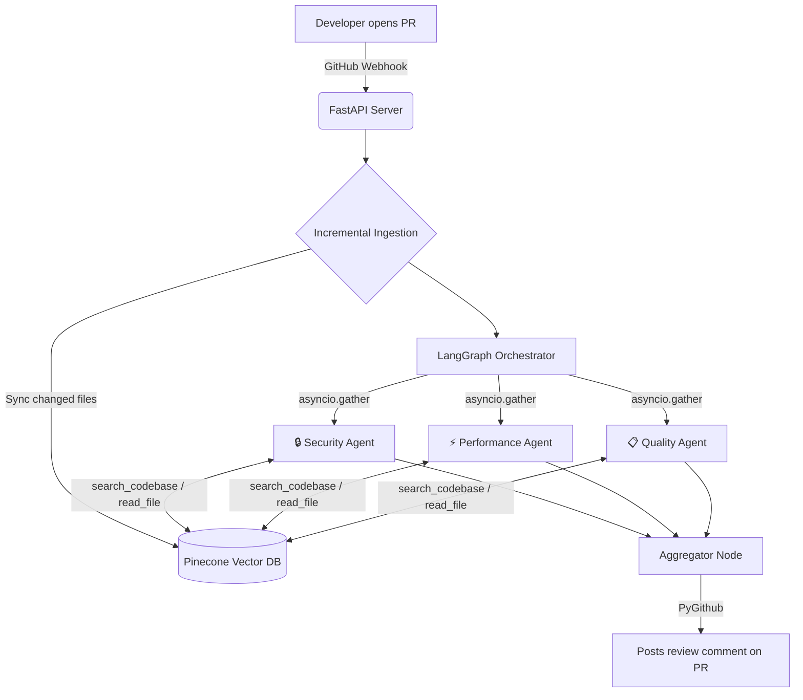

# 🛡️ PR Sentinel — Automated Multi-Agent Code Reviewer

A fully autonomous GitHub PR reviewer that spins up three specialized AI agents in parallel — Security, Performance, and Code Quality — and posts a structured review directly on your pull request. No manual triggers. No dashboards. Just open a PR and get a review.

> [!TIP]
> **Try it yourself!** You can install the bot on your own public or private repositories right now.
> 👉 **[Install PR Sentinel GitHub App](https://github.com/apps/sentinel-pr-reviewer-bot)** 
---

## How It Works

When a developer opens a PR, GitHub fires a webhook to the FastAPI backend. From there:

1. **Incremental ingestion** — only the changed files are re-embedded into Pinecone, keeping the vector index in sync without re-processing the entire repo every time
2. **Multi-agent fan-out** — three specialized agents launch in parallel via `asyncio.gather()`, each with its own focus and system prompt
3. **RAG-powered analysis** — each agent uses tool calling (`search_codebase`, `read_file`, `grep_code`) to retrieve relevant context from the vectorized codebase before drawing conclusions
4. **Aggregated review** — findings from all three agents are merged into a single structured Markdown comment posted directly on the PR



---

## Tech Stack

| Layer | Technology |
|---|---|
| Backend | FastAPI, Uvicorn, Python 3.9 |
| Agent Orchestration | LangGraph |
| Vector Database | Pinecone (serverless) |
| Embeddings | `gemini-embedding-2-preview` (768 dimensions) |
| LLM | Google GenAI SDK — `gemini-2.5-flash-lite` |
| GitHub Integration | PyGithub, HMAC-SHA256 webhook verification |

---

## Sample PR Review Output

```
## 🤖 Automated PR Review

### 🔒 Security (2 issues found)
- **[HIGH]** `src/auth/login.py:45` — User input concatenated directly into SQL query
- **[MEDIUM]** `src/config.py:12` — API key hardcoded in source file

### ⚡ Performance (1 issue found)
- **[MEDIUM]** `src/api/users.py:78` — N+1 query pattern in user fetch loop

### 📋 Code Quality (2 issues found)
- **[LOW]** `src/utils/helpers.py:23` — Function exceeds 50 lines, consider splitting
- **[LOW]** `src/api/routes.py:67` — Missing error handling on external API call
```

---

## Engineering Challenges

### Parallel agents hitting rate limits and server errors

Moving from a single agent to three parallel agents immediately caused problems. All three fired API requests to Gemini at the same moment, triggering `429 RESOURCE_EXHAUSTED` and `503 UNAVAILABLE` (High Demand) errors consistently on the free tier.

The fix was extracting all API logic into a centralized `retry_utils.py` module. It uses an exponential backoff strategy with randomized jitter to handle `503` server spikes gracefully, and fast-fails on unrecoverable Daily Quota limits. 

Additionally, because Gemini 3.5 requires `thought_signatures` for tool calls, the code was updated to pass native `types.Content` objects directly through the message chain, avoiding complex JSON parsing errors during retries.

---

## Setup

### Prerequisites
- Python 3.9+
- Pinecone account (free tier is enough)
- Google AI Studio API key
- GitHub repo with webhook access

### Installation

```bash
git clone https://github.com/yourusername/pr-sentinel
cd pr-sentinel
python -m venv venv
source venv/bin/activate
pip install -r requirements.txt
```

### Environment variables

Create a `.env` file:

```
GEMINI_API_KEY=your_key
PINECONE_API_KEY=your_key
GITHUB_WEBHOOK_SECRET=your_secret
GITHUB_TOKEN=your_token
```

### Run

```bash
uvicorn main:app --reload
```

Expose your local server with ngrok for webhook testing:

```bash
ngrok http 8000
```

Then add `https://your-ngrok-url/webhook` as a webhook in your GitHub repo settings (select "Pull requests" event).

---

## Project Structure

```
automated-pr-reviewer/
├── backend/
│   ├── agent.py         # LangGraph multi-agent orchestration
│   ├── embeddings.py    # Pinecone store/search (all vector DB code)
│   ├── ingestion.py     # GitHub file fetching + chunking
│   ├── llm_client.py    # All LLM-specific code (swap Gemini↔Claude here)
│   ├── main.py          # FastAPI app, entry point
│   ├── retry_utils.py   # Centralized Gemini API retry & backoff logic
│   ├── test_multi_agent.py # Local multi-agent run simulator
│   ├── test_retry_utils.py # Unit tests for API error handling
│   ├── tools.py         # search_codebase, read_file, grep_code
│   ├── webhooks.py      # Webhook verification + PR event handling
│   ├── requirements.txt
│   └── .env
├── .gitignore
├── milestones.md
└── README.md
```

---

## Roadmap

- [ ] React dashboard to view past reviews and trigger analysis manually
- [ ] Real-time agent progress via WebSockets
- [ ] Support for larger PRs with file size limits and batching
- [ ] Switch to Claude API for production (only `llm_client.py` changes)