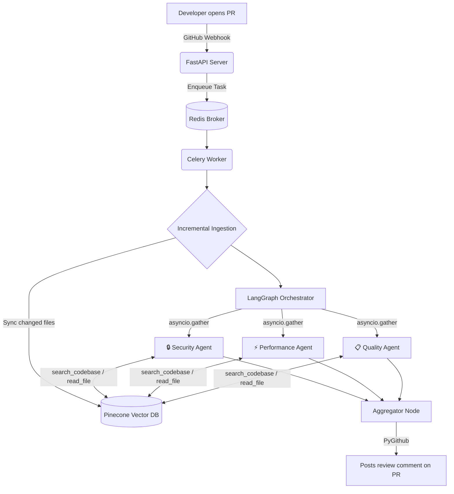

# 🛡️ PR Sentinel — Automated Multi-Agent Code Reviewer

A fully autonomous GitHub PR reviewer that spins up three specialized AI agents in parallel — Security, Performance, and Code Quality — and posts a structured review directly on your pull request. No manual triggers. No dashboards. Just open a PR and get a review.

> [!TIP]
> **Try it yourself!** You can install the bot on your own public or private repositories right now.
> 👉 **[Install PR Sentinel GitHub App](https://github.com/apps/sentinel-pr-reviewer-bot)** 
---

## How It Works

When a developer opens a PR, GitHub fires a webhook to the FastAPI backend. From there:

1. **Durable Task Queue** — webhook pushes a task to Redis and returns `202 Accepted` immediately, preventing GitHub webhook timeouts
2. **Incremental ingestion** — a Celery worker picks up the job and re-embeds only the changed files into Pinecone
3. **Multi-agent fan-out** — three specialized agents launch in parallel via `asyncio.gather()` inside the worker process
4. **RAG-powered analysis** — each agent uses tool calling (`search_codebase`, `read_file`, `grep_code`) to retrieve relevant context
5. **Aggregated review** — findings from all three agents are merged into a single structured Markdown comment posted directly on the PR



---

## Tech Stack

| Layer | Technology |
|---|---|
| Backend | FastAPI, Uvicorn, Python 3.11 |
| Task Queue / Broker | Celery + Redis Labs |
| Agent Orchestration | LangGraph |
| Vector Database | Pinecone (serverless) |
| Embeddings | `gemini-embedding-2-preview` (768 dimensions) |
| LLM | Google GenAI SDK — `gemini-2.5-flash-lite` |
| GitHub Integration | PyGithub, HMAC-SHA256 webhook verification |

---

## Sample PR Review Output

```
## 🤖 Automated PR Review

### 🔒 Security (2 issues found)
- **[HIGH]** `src/auth/login.py:45` — User input concatenated directly into SQL query
- **[MEDIUM]** `src/config.py:12` — API key hardcoded in source file

### ⚡ Performance (1 issue found)
- **[MEDIUM]** `src/api/users.py:78` — N+1 query pattern in user fetch loop

### 📋 Code Quality (2 issues found)
- **[LOW]** `src/utils/helpers.py:23` — Function exceeds 50 lines, consider splitting
- **[LOW]** `src/api/routes.py:67` — Missing error handling on external API call
```

---

## Engineering Challenges

### Parallel agents hitting rate limits and server errors

Moving from a single agent to three parallel agents immediately caused problems. All three fired API requests to Gemini at the same moment, triggering `429 RESOURCE_EXHAUSTED` and `503 UNAVAILABLE` (High Demand) errors consistently on the free tier.

The fix was extracting all API logic into a centralized `retry_utils.py` module. It uses an exponential backoff strategy with randomized jitter to handle `503` server spikes gracefully, and fast-fails on unrecoverable Daily Quota limits. 

Additionally, because Gemini 3.5 requires `thought_signatures` for tool calls, the code was updated to pass native `types.Content` objects directly through the message chain, avoiding complex JSON parsing errors during retries.

### Webhook Timeouts and Thread Blocking

Initially, FastAPI's `BackgroundTasks` was used to process the PRs asynchronously. However, GitHub requires webhooks to respond within 10 seconds. The webhook handler was inadvertently waiting on heavy synchronous GitHub API calls (like fetching PR files), and the AI processing itself blocked the underlying event loop during long waits. 

If Gemini's API was down and exponential backoff triggered a 30-second `time.sleep()`, the entire event loop halted—blocking all other incoming webhook requests. 

**The Solution:** The architecture was refactored to use a **Durable Task Queue**. FastAPI now immediately pushes the job to a Cloud Redis instance and returns `202 Accepted` to GitHub. A separate **Celery worker** process running in the same Docker container polls Redis, picks up the jobs, and executes the heavy LLM tasks. If an API request fails, the worker releases the thread, schedules a retry for the future in Redis, and picks up the next task.

### Graceful UX & Connection Pooling

A durable queue introduced two new challenges:
1. **Ghosting the User:** While a PR sat in the queue during traffic spikes, the user saw no feedback and assumed the bot was broken.
2. **Redis Connection Limits:** Scaling the app caused Uvicorn and Celery to open dozens of connection pools, instantly crashing the Redis Labs free tier limit (30 max connections).

**The Solution:** 
- The webhook now instantly posts a "⏳ **Queued**" placeholder comment to the PR *before* passing the job to Celery, along with the `comment_id`. When the Celery worker finishes, it perfectly overwrites the placeholder with the final review. If the worker encounters a non-recoverable error (like a completely exhausted API quota), it edits the placeholder to explain the exact failure reason.
- Strict connection limits (`broker_pool_limit=2`, `max_connections=5`) were enforced across the stack to guarantee the app remains perfectly stable on the free tier, no matter how many Cloud Run instances spin up.

---

## Setup

### Prerequisites
- Python 3.11+
- Redis (Local or Cloud instance like Redis Labs)
- Pinecone account (free tier is enough)
- Google AI Studio API key
- GitHub repo with webhook access

### Installation

```bash
git clone https://github.com/yourusername/pr-sentinel
cd pr-sentinel
python -m venv venv
source venv/bin/activate
cd backend
pip install -r requirements.txt
```

### Environment variables

Create a `.env` file in the `backend/` directory:

```
GEMINI_API_KEY=your_key
PINECONE_API_KEY=your_key
GITHUB_WEBHOOK_SECRET=your_secret
GITHUB_TOKEN=your_token
REDIS_URL=redis://localhost:6379/0
```

### Run

You need two terminal windows to run both the web server and the worker locally:

**Terminal 1 — FastAPI Server**
```bash
cd backend
uvicorn main:app --reload --port 8080
```

**Terminal 2 — Celery Worker**
```bash
cd backend
PYTHONPATH=$(pwd) celery -A celery_app worker --loglevel=info --concurrency=2
```

Expose your local server with ngrok for webhook testing:

```bash
ngrok http 8000
```

Then add `https://your-ngrok-url/webhook` as a webhook in your GitHub repo settings (select "Pull requests" event).

---

## Project Structure

```
automated-pr-reviewer/
├── backend/
│   ├── agent.py         # LangGraph multi-agent orchestration
│   ├── celery_app.py    # Celery and Redis broker configuration
│   ├── embeddings.py    # Pinecone store/search (all vector DB code)
│   ├── ingestion.py     # GitHub file fetching + chunking
│   ├── llm_client.py    # All LLM-specific code (swap Gemini↔Claude here)
│   ├── main.py          # FastAPI app, entry point
│   ├── quota.py         # Redis-backed atomic daily rate limiting
│   ├── redis_client.py  # Centralized Redis connection manager
│   ├── retry_utils.py   # Centralized Gemini API retry & backoff logic
│   ├── tasks.py         # Celery task definitions (ingest, review)
│   ├── tools.py         # search_codebase, read_file, grep_code
│   ├── webhooks.py      # Webhook verification + Redis queueing
│   ├── requirements.txt
│   └── .env
├── Dockerfile           # Multi-process container (uvicorn + celery)
├── Procfile             # Process definitions for deployment
├── .gitignore
├── milestones.md
└── README.md
```

---

## Roadmap

- [ ] React dashboard to view past reviews and trigger analysis manually
- [ ] Real-time agent progress via WebSockets
- [ ] Support for larger PRs with file size limits and batching
- [ ] Switch to Claude API for production (only `llm_client.py` changes)